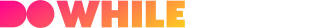
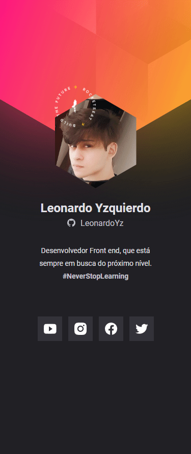

 
 
 

<h2>🖥️ Desktop</h2>

 
 

<h2>📱 Mobile</h2>

 
 

#

<h2>🔗 Links</h2>
<ul>
  <li>Demo URL: <a href="https://leonardoyz.github.io/NLWHeat-Origin/">Demo</a></li>
</ul>

#

<h3>🔨 Built with</h3>

<ul>
  <li>Semantic HTML5 markup</li>
  <li>CSS custom properties</li>
  <li>Flexbox</li>
  <li>Mobile-first workflow</li>
  <li>Javascript</li>
</ul>
